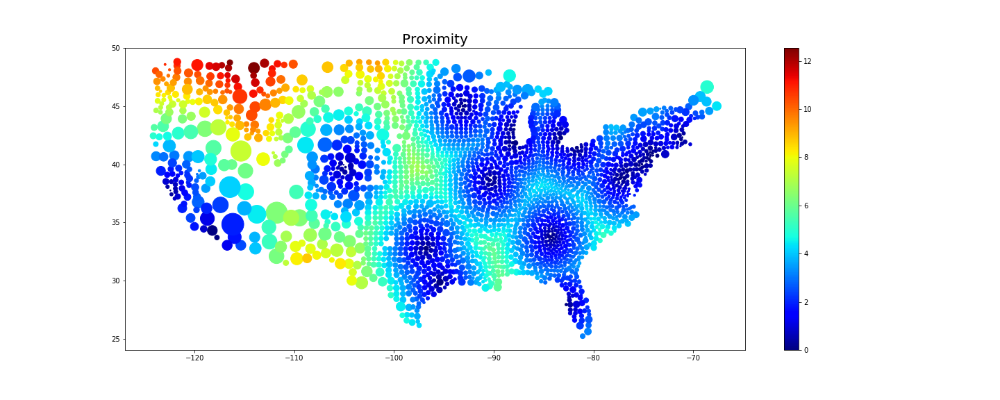
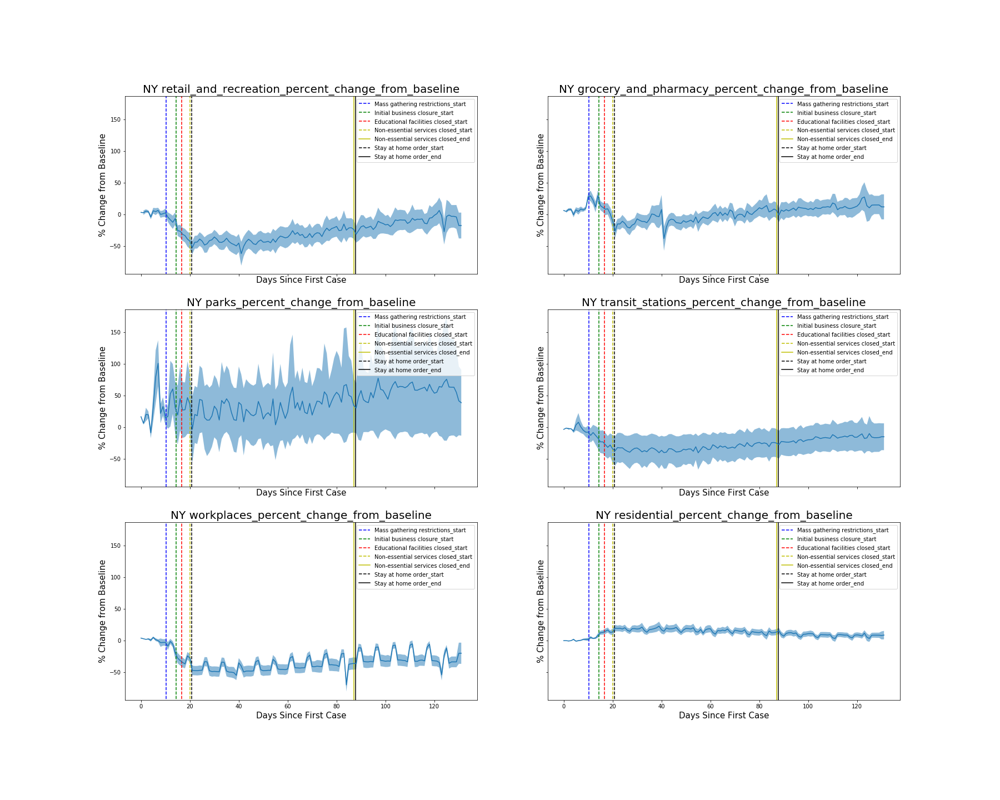
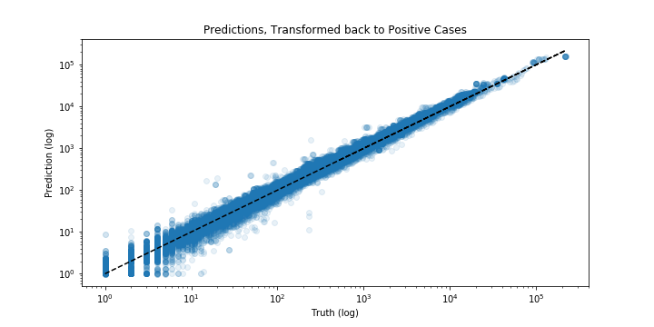

# COVID-19_Project

## View the final report in the Final_Report_19MAY2020.pdf file

Explores the COVID-19 pandemic.
Perform brief exploratory data analysis, gather understanding of the data and underlying trends. Observe the value of statewide mandates, and correlations of various features to COVID-19 spread.
Develop predictive model for COVID-19 positive cases normalized to the population size for all counties with data and an acceptable FIPS ID.

## Preview of Results are given below.

First to get a general understanding of U.S. trends with positive cases over time. It is clear that states have started to level off in terms of new positive cases per day.

Next, given the data and the latitude/longitude information, proximity stats can be calculated. I generate these for proximity to a "big city", which is defined as the population density being over some predefined limit. I can generate plots such as the following from this data.

Next to Assess the Google Trend data, which is important time dependent data that outlines foot traffic in certain areas compared to baseline. In the report I go further into this, but it is interesting to see how the general public reacted to certain mandates.

Now for the predictive model. An AdaBoost model with Decision Tree Regressor base estimators was used to predict the Number of Positive Cases, normalized to a county's population size. I normalized it to population size so that the target variable was a normal distribution. This makes it easy to transform predictions back to the absolute Positive Cases Value. In all, the $R^2$ value was $>.94$

These predicted values are for 7 days in the future, since there is higher utility in predicting number of cases 7 days out compared to just the following day. Predicted values can be normalized to produced plots such as the following.

While the goal of the project was to predict a relative risk, the model still does quite well in predicting trends over time. Now that enough data is present to observe steady increases, plateaus, and resurgences of cases, it's great to see that the model was capable of capturing all of these types.

